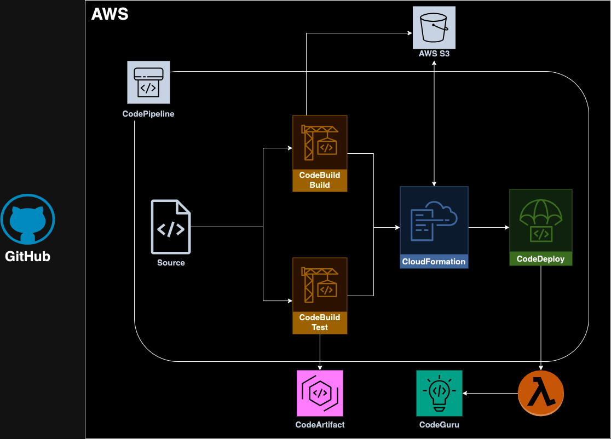

# Introduction

I started studying for the [AWS Certified DevOps Engineer - Professional](https://aws.amazon.com/certification/certified-devops-engineer-professional/) through the amazing course by [Stephane Maarek](https://www.udemy.com/course/aws-certified-devops-engineer-professional-hands-on), but I felt I was missing a project where I could put in practice what I had learned. So, I decided to write some blogs to cover what I learned and share it with the community.

After going through all the posts you will be able to understand the concepts of some AWS services that together delivery companies standardized templates and automations.

# Domain 1: SDLC Automation

The software developer lifecycle (SDLC) automation consists of how can we reduce the overhead of manual processes and reduce lead time. These improvements are related to DevOps, consequently CI/CD processes.

The Domain 1 is covered by some AWS tools that help the engineers saving time and companies saving money, that services are:

1. **CodePipeline**: AWS pipeline with stages which can execute parallel or in sequence. It's possible to integrate with other services like Lambda, CloudFormation, CodeBuild, etc;
2. **CodeBuild**: Fully managed CI service that compiles source code, runs tests, produces software packages ready for deployment;
3. **CodeDeploy**: Responsible for managing deployment on Lambda, ECS, EC2 and on-premise. Some deployment strategies like blue/green and canary are available;
4. **CodeArtifact**: Service dedicated to store dependencies such as Maven, Gradle, npm, yarn, twine, pip and NuGet;
5. **CodeGuru**: Give recommendations to identify critical vulnerabilities, leak, input validation and code best practices. Besides that can be integrated with a application to analyze performance, giving insights;
6. **EC2 Image Builder**: Used to create Virtual Machine or containers images;
7. **Amplify**: Solution that allows frontend web and mobile developers to easily build, connect, and host full stack applications.  This is great if you're a start-up or you just wanna get a prototype going as quickly as possible.

# Hands-on

Let's practice doing a pipeline following the image below.

<!--
<architecture-image>
-->

This hands-on consists of:

1. GitHub repository trigger CodePipeline after a commit into main branch;
2. First Codebuild is responsible to build the application and send to S3 as a Zip file;
3. Second Codebuild is responsible to test the application, but the dependencies are consumed from CodeArtifact;
4. Although the CloudFormation is not covered into the Domain 1, it's used to provisioning the Lambda infrastructure creating the versions;
5. CodeDeploy changes the label from the previous version to the latest version.
6. CodeGuru monitoring the lambda to check if there are some performance improvements to do.

Besides the simple CloudFormation used into CodePipeline to provisioning the lambda all the resources will be created using [CDK](https://docs.aws.amazon.com/cdk/v2/guide/home.html) with python.

-----------------------

## Establish connection between AWS and GitHub repository

AWS uses [connections](https://docs.aws.amazon.com/dtconsole/latest/userguide/welcome-connections.html) to establish a trust communication with GitHub. To create it's very simple, follow the next steps:

1. Access [AWS Developer Tools](https://console.aws.amazon.com/codesuite/home);
2. `Settings` -> `Connections`;
3. `Create connection` button;
4. Select `GitHub` as provider;
5. fill in the field `Connection name`;
6. `Connect to GitHub` button;
7. Allow in the browser the connection;
8. `Install a new app` button;
9. Select the organization where the app will be created;
10. Select which repositories this app will have access;
11. `Connect` button.

If you would like to know more about GitHub App check the [documentation](https://docs.github.com/en/apps/using-github-apps/about-using-github-apps).

## First CodePipeline

As described previously all the components inside the pipeline will be provisioning using CDK, so if you had never used it follow the [documentation](https://docs.aws.amazon.com/cdk/v2/guide/getting_started.html).

<!--
Bucket S3
CodeBuild Build
CodeBuild Test
CodePipeline
----------
CodeDeploy
CodeArtifact
Lambda
CodeGuru
 -->

 export REPOSITORY_OWNER="rafaelsvieira"
 export REPOSITORY_NAME="aws-dop-1-labs"